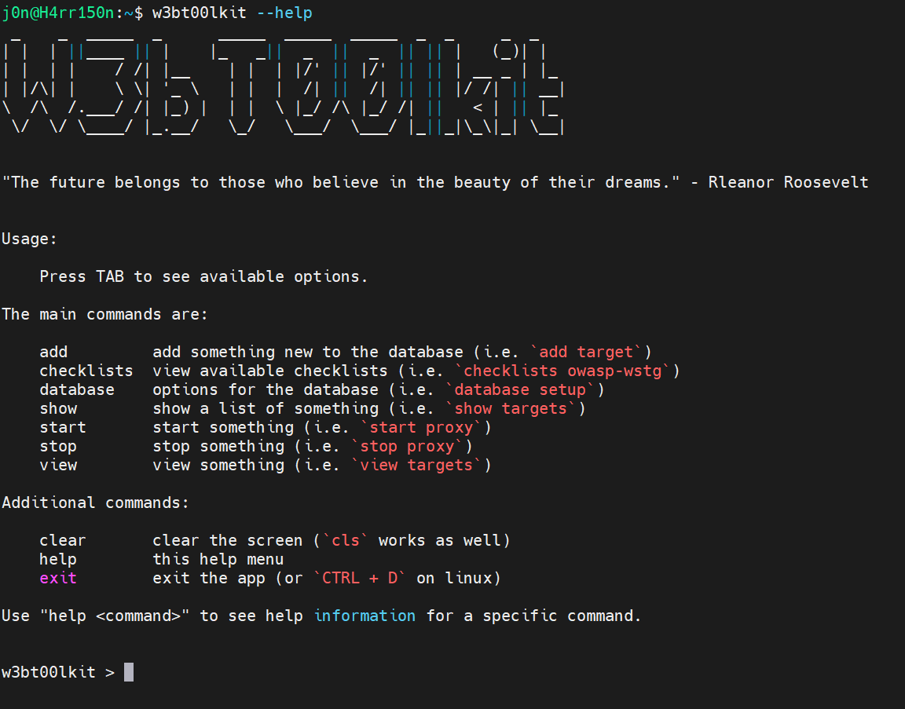

# w3bt00lkit
Command-line web application security toolkit.  

## Features

## General Features

1. Tab suggestion / completion  
2. Typing `clear` or `cls` followed by `enter` will clear the screen.
3. `back` menu option
4. `help` menu option
5. `exit` menu option

## Custom Features

1. Targets
    1. Add a new target and save it in the database.
    2. List all active targets from the database.
    3. Select a target to be used throughout the entire w3bt00lkit.
    4. Add scope items (in and out of scope) to a target.
2. Database
    1. Setup
    2. List tables
3. Checklists
    1. OWASP Web Security Testing Guide (WSTG) v.4.2.
4. Proxy
    1. Save requests and responses from the proxy that are `in scope` based on the target selected.

## Integrations

1. Integration with man-in-the-middle proxy ([mitmproxy](https://github.com/mitmproxy/mitmproxy)).  

## Roadmap

- Update the proxy code to store additional information in the database.
- Integrate existing tools into the w3bt00lkit and store the results in the database.
- TBD...

## Install

1. Clone the repo
2. Create a python virtual environment
3. Install requirements
4. Create an `alias` to load the virtual environment and then the `main.py` script in the `src` folder.
5. Make sure `PostgreSQL` is running locally and the necessary permissions are added.
6. Install the [mitmproxy](https://docs.mitmproxy.org/stable/concepts-certificates/) certificate in the browser you will use with the proxy.
7. Install [FoxProxy](https://getfoxyproxy.org/) or similar tool and set it to the port `8085`.
8. Run the toolkit with the `alias`
9. Create the database tables and insert initial data to the database.
    - `w3bt00lkit` > `database`
    - `w3bt00lkit (database)` > `setup`

### Style and Syntax  
`pylint ./src --output=pylint.txt ; cat pylint.txt`  

### Units Tests and Code Coverage  
`coverage run -m unittest discover -s src/tests/ && coverage report`  

### Generate Documentation  
From the `src` folder:  
`pdoc --html . --output-dir ../docs`  

Then go to `docs/src/index.html` to view the generated documentation.  

## DISCLAIMER

The w3bt00lkit is intended for educational purposes only and is provided without warranty. Use of this w3bt00lkit is at your own risk. The author is not responsible for any damages or liabilities incurred as a result of the use or misuse of this w3bt00lkit. Always adhere to legal and ethical guidelines.
